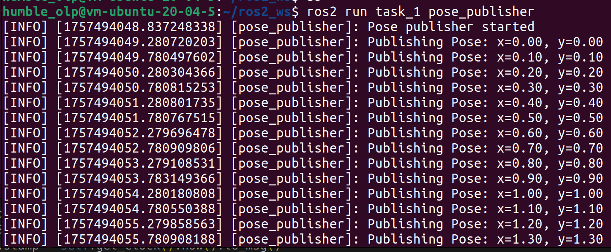
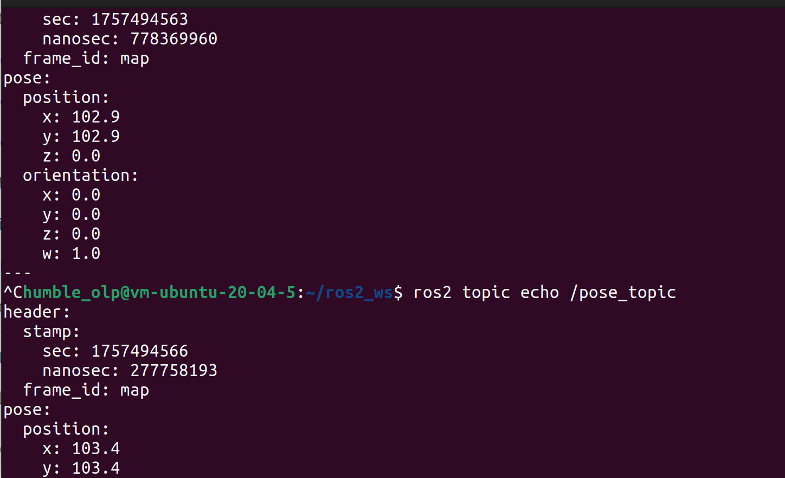
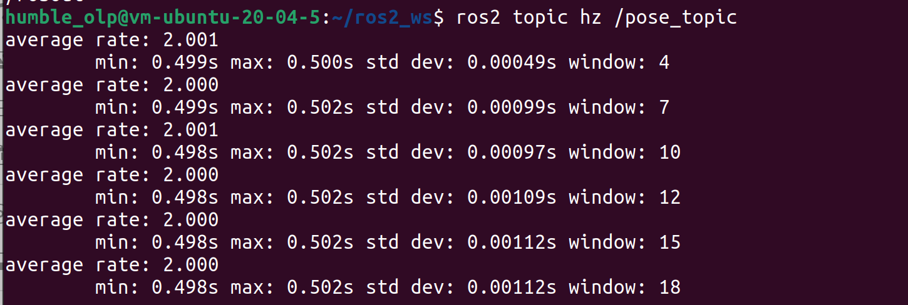
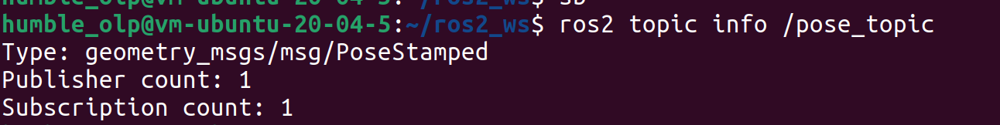

# Lab 1


```
alias sb="source ~/ros2_ws/install/setup.bash"
```


---------------------------------------------------------------------
## Task 1
### Create pkg task_1
(from the src folder inside your workspace)
```
ros2 pkg create --build-type ament_python <package_name> --license Apache-2.0 -- dependencies rclpy std_msgs geometry_msgs
```
### Create a publisher node 
(make sure you are in ros2_ws/src/task_1/task_1)
```
touch pose_pubslisher.py
nano pose_publisher.py
```
Pose_publisher code:
```

```
### Create a subscriber node 
```
touch subscriber.py
nano subscriber.py
```
Subscriber code:
```

```
## Use the corresponding commands to test in the terminal:
```
ros2 run task_1 pose_publisher
```


### The existence of the topic
´´´
ros2 topic list
´´´


### The value of the message
´´´
ros2 topic echo /pose_topic
´´´

### The frequency of the topic
´´´
ros2 topic hz /pose_topic
´´´

### The number of subscribers and publisher for the topic
´´´
ros2 topic info /pose_topic
´´´

### OPTIONAL 1:
1. Explain what would be the QoS parameters for critical data in the system?
2. What about live data?
3. What type of data would it make sense to use Transient Local with?


In the pose_publisher we use these parameters:
```
self.qos_profile = QoSProfile(
            reliability=ReliabilityPolicy.RELIABLE,
            durability=DurabilityPolicy.TRANSIENT_LOCAL,
            history=HistoryPolicy.KEEP_LAST,
            depth=10
```
1. If we refer to [ROS2 Documentation](https://docs.ros.org/en/rolling/Concepts/Intermediate/About-Quality-of-Service-Settings.html) then can see that Quality of Service (QoS) policies are used to let you set the communication between nodes.
As I understand the critical data in this case is the position date:
pose.position.x and pose.position.y, also could be pose.orientation.
Because robot’s position is essential for navigation or decision-making, our **Reliability** parameter is RELIABLE. 
Otherwise, we can lose samples, if the network is not working well;
***Durability** is TRANSIENT_LOCAL to make sure that late subscribers will still get the last message;
2. **History** KEEP_LAST work well with critical and live data(most recent) like robot pose. And depth=10 keeps the last 10 messages in a buffer.
3. From the ROS2 Documentation we can see that "Transient local: the publisher becomes responsible for persisting samples for “late-joining” subscriptions." Also going through [this source](https://robotics.stackexchange.com/questions/24889/qos-history-policy-in-case-of-durability-volatile-and-reliability-best-effort) and [this](https://docs.clearpathrobotics.com/docs/ros/api/overview/#:~:text=Transient%20Local%E2%80%8B&text=The%20Transient%20Local%20QoS%20Profile,topic%20which%20offers%20system%20logs.) **Transient Local** is used when you want new subscribers, which connect later, to automatically receive the last published message(s) that were saved by the publisher. Then in the case of Task 1, parameter  **Volatile** also could be used, beacause we are not supposed to have late subscribers, but at the same time Volatile only delivers data to subscribers that are connected immediately. Once a subscriber joins, it only gets new messages.
Answering the question: real-time sensor data, robot description/URDF and robot position for starting later nodes.  

