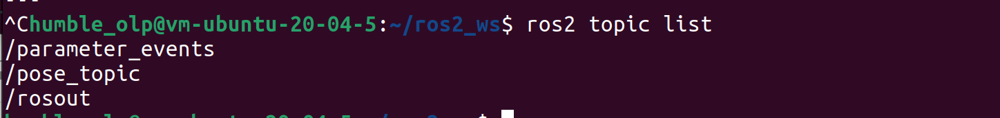

# Lab 1


```
alias sb="source ~/ros2_ws/install/setup.bash"
```


---------------------------------------------------------------------
## Task 1
### Create pkg task_1
(from the src folder inside your workspace)
```
ros2 pkg create --build-type ament_python <package_name> --license Apache-2.0 -- dependencies rclpy std_msgs geometry_msgs
```
### Create a publisher node 
(make sure you are in ros2_ws/src/task_1/task_1)
```
touch pose_pubslisher.py
nano pose_publisher.py
```
Pose_publisher code:
```

```
### Create a subscriber node 
```
touch subscriber.py
nano subscriber.py
```
Pose_publisher code:
```

```
## Use the corresponding commands to test in the terminal:
```
ros2 run task_1 pose_publisher
```


### The existence of the topic
´´´
ros2 topic list
´´´


### The value of the message
´´´
ros2 topic echo /pose_topic
´´´

### The frequency of the topic
´´´
ros2 topic hz /pose_topic
´´´

### The number of subscribers and publisher for the topic
´´´
ros2 topic info /pose_topic
´´´

### OPTIONAL 1:


