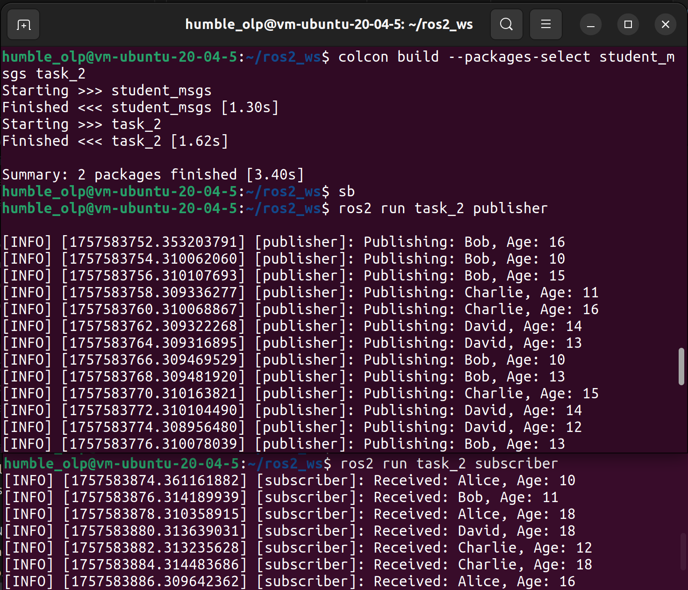
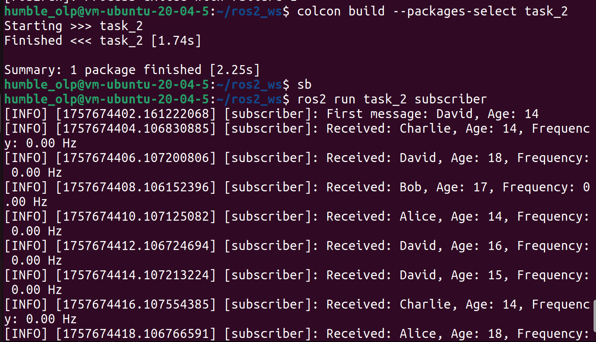

## 2.- Custom Messaging
(we've been working together on this task, so we have diff. workspaces: ros2_ws and Group3)
### Move into src folder in your workspace
```
cd Group_3/src
```

### Create a new package for custom message
```
ros2 pkg create --build-type ament_cmake --license Apache-2.0 custom_interface --dependencies rclcpp std_msgs
```


### In the package make the folder and create a new empty file
```
cd custom_interface
mkdir msg
cd msg
touch Person.msg
```
```
cat <<EOF > Person.msg
string name
int32 age
bool is_student
EOF
```
### Modify CMakeLists.txt and package.xml 
```
cd ..
ls
code .
```
CMakeLists.txt
```
cmake_minimum_required(VERSION 3.8)
project(custom_interface)

if(CMAKE_COMPILER_IS_GNUCXX OR CMAKE_CXX_COMPILER_ID MATCHES "Clang")
  add_compile_options(-Wall -Wextra -Wpedantic)
endif()

# find dependencies
find_package(ament_cmake REQUIRED)
find_package(rclcpp REQUIRED)
find_package(std_msgs REQUIRED)
find_package(rosidl_default_generators REQUIRED)
rosidl_generate_interfaces(${PROJECT_NAME} "msg/Person.msg" )

if(BUILD_TESTING)
  find_package(ament_lint_auto REQUIRED)
  # the following line skips the linter which checks for copyrights
  # comment the line when a copyright and license is added to all source files
  set(ament_cmake_copyright_FOUND TRUE)
  # the following line skips cpplint (only works in a git repo)
  # comment the line when this package is in a git repo and when
  # a copyright and license is added to all source files
  set(ament_cmake_cpplint_FOUND TRUE)
  ament_lint_auto_find_test_dependencies()
endif()

ament_package()
```
package.xml 
```
<?xml version="1.0"?>
<?xml-model href="http://download.ros.org/schema/package_format3.xsd" schematypens="http://www.w3.org/2001/XMLSchema"?>
<package format="3">
  <name>custom_interface</name>
  <version>0.0.0</version>
  <description>TODO: Package description</description>
  <maintainer email="humble_olp@todo.todo">humble_olp</maintainer>
  <license>Apache-2.0</license>

  <buildtool_depend>ament_cmake</buildtool_depend>
  <build_depend>rosidl_default_generators</build_depend>
  <exec_depend>rosidl_default_runtime</exec_depend>
  <member_of_group>rosidl_interface_packages</member_of_group>

  <depend>rclcpp</depend>
  <depend>std_msgs</depend>

  <test_depend>ament_lint_auto</test_depend>
  <test_depend>ament_lint_common</test_depend>

  <export>
    <build_type>ament_cmake</build_type>
  </export>
</package>
```
### Check if the new message is available
```
cd ~/Group_3
colcon build --packages-select custom_interface
source install/setup.bash
ros2 interface show custom_interface/msg/Person
```


## Task 2

### Create a package for the custom message
```
cd src
ros2 pkg create student_msgs --build-type ament_cmake --license Apache-2.0 --dependencies std_msgs
```
### Define the custom message
```
cd student_msgsmk
mkdir msg
cd msg
touch StudentAge.msg
```
```
cat <<EOF > StudentAge.msg
string name
int32 age
bool is_student
EOF
```
### Add to CMakeLists.txt and package.xml
CMakeLists.txt
```
find_package(rosidl_default_generators REQUIRED)

rosidl_generate_interfaces(${PROJECT_NAME}
  "msg/StudentAge.msg"
)
```
package.xml
```
<build_depend>rosidl_default_generators</build_depend>
<exec_depend>rosidl_default_runtime</exec_depend>
<member_of_group>rosidl_interface_packages</member_of_group>
```
Build:
```
colcon build --packages-select student_msgs
sb (source install/setup.bash)
```
### Create a python package
(in src)
```
ros2 pkg create task_2 --build-type ament_python --license Apache-2.0 --dependencies rclpy student_msgs
```
### Create publisher and subscriber 
(in task2/task2)
publisher.py
```
import rclpy
from rclpy.node import Node
from student_msgs.msg import StudentAge
import random

class StudentAgePublisher(Node):
    def __init__(self):
        super().__init__('publisher')
        self.publisher_ = self.create_publisher(StudentAge, 'student_age', 10)
        self.timer = self.create_timer(2.0, self.publish_student_age)
        self.names = ['Alice', 'Bob', 'Charlie', 'David']

    def publish_student_age(self):
        msg = StudentAge()
        msg.name = random.choice(self.names)
        msg.age = random.randint(10, 18)
        self.publisher_.publish(msg)
        self.get_logger().info(f'Publishing: {msg.name}, Age: {msg.age}')

def main(args=None):
    rclpy.init(args=args)
    node = StudentAgePublisher()
    rclpy.spin(node)
    node.destroy_node()
    rclpy.shutdown()

if __name__ == '__main__':
    main()
```
subscriber.py
```
import rclpy
from rclpy.node import Node
from student_msgs.msg import StudentAge

class StudentAgeSubscriber(Node):
    def __init__(self):
        super().__init__('subscriber')
        self.subscription = self.create_subscription(
            StudentAge,
            'student_age',
            self.listener_callback,
            10
        )

    def listener_callback(self, msg):
        self.get_logger().info(f'Received: {msg.name}, Age: {msg.age}')

def main(args=None):
    rclpy.init(args=args)
    node = StudentAgeSubscriber()
    rclpy.spin(node)
    node.destroy_node()
    rclpy.shutdown()

if __name__ == '__main__':
    main()
```
### Update setup.py
```
entry_points={
        'console_scripts': [
            'publisher = task_2.publisher:main',
            'subscriber = task_2.subscriber:main',
        ],
    },
```
Build:
```
colcon build --packages-select student_msgs task_2
sb (source install/setup.bash)
```
Running from workspace folder:
```
ros2 run task_2 pubslisher
```
```
ros2 run task_2 subscriber
```



### Optional
(in ~/ros2_ws/src/student_msgs/msg)
```
nano StudentAge.msg
```
add to the top Header message
```
std_msgs/Header header
string name
int8 age
```
### Adding deepeencies 
to CMakeLists.txt, so it look like this:
```
rosidl_generate_interfaces(${PROJECT_NAME}
  "msg/StudentAge.msg"
  DEPENDENCIES std_msgs
)
```
### Build the package in the root of your workspace
```
colcon build --packages-select student_msgs
sb (source install/setup.bash)
```
### Subscriber should look like this:
```
import rclpy
from rclpy.node import Node
from student_msgs.msg import StudentAge

class StudentAgeSubscriber(Node):
    def __init__(self):
        super().__init__('subscriber')
        self.subscription = self.create_subscription(
            StudentAge,
            'student_age',
            self.listener_callback,
            10
        )
        self.last_stamp = None  # store the last timestamp

    def listener_callback(self, msg):
        stamp = msg.header.stamp.sec + msg.header.stamp.nanosec * 1e-9
        if self.last_stamp is not None:
            dt = stamp - self.last_stamp
            freq = 1.0 / dt if dt > 0 else 0.0
            self.get_logger().info(
                f'Received: {msg.name}, Age: {msg.age}, Frequency: {freq:.2f} Hz'
            )
        else:
            self.get_logger().info(
                f'First message: {msg.name}, Age: {msg.age}'
            )
        self.last_stamp = stamp

def main(args=None):
    rclpy.init(args=args)
    node = StudentAgeSubscriber()
    rclpy.spin(node)
    node.destroy_node()
    rclpy.shutdown()

if __name__ == '__main__':
    main()
```
### Build and run 
(in ros2_ws:)
```
colcon build --packages-select task_2
sb
ros2 run task_2 publisher 
ros2 run task_2 subscriber 
```

