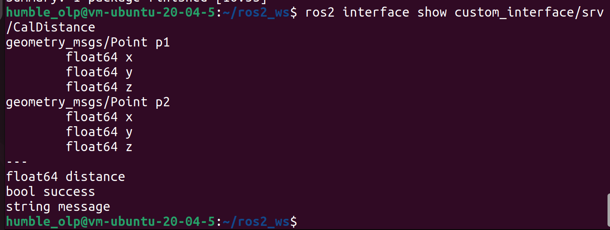
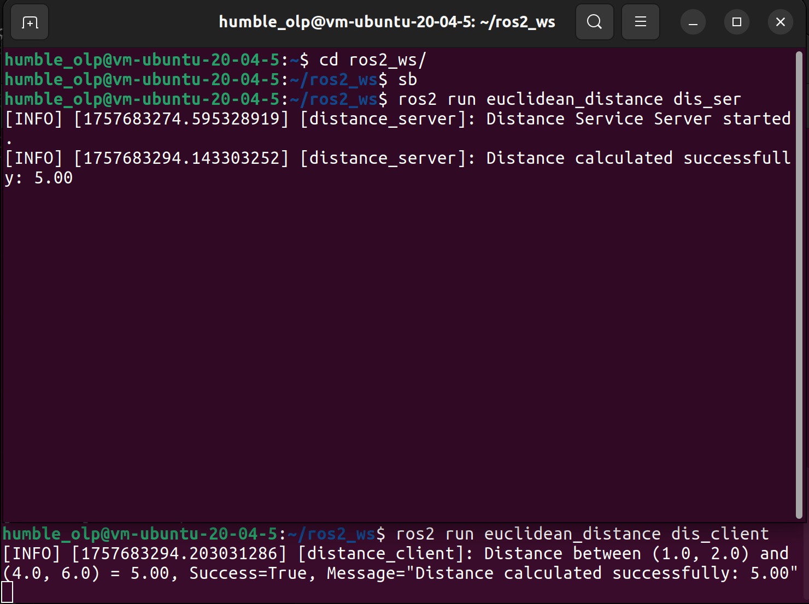
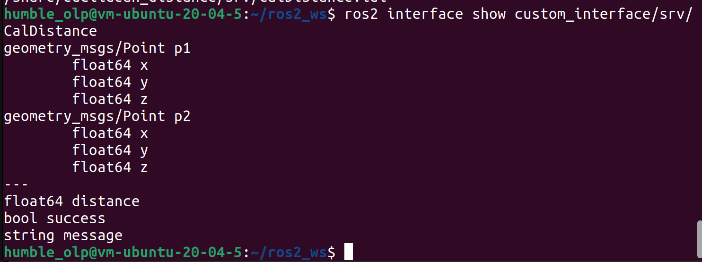

## 3.- Services
### Create a new package 
(in src)
```
ros2 pkg create --build-type ament_python --license Apache-2.0 service_example --dependencies rclpy example_interfaces
```
### Navigate to the folder service_example folder and create a file called add_two_ints_server.py.
```
cd service_example/service_example
```
```
cat <<EOF > add_two_ints_server.py
import rclpy
from rclpy.node import Node
from example_interfaces.srv import AddTwoInts

class SumServerNode(Node):
    def __init__(self):
        super().__init__("sum_server")
        self.server_ = self.create_service(
            AddTwoInts,
            "add_two_ints", # TODO: give your sevice a name
            self.sum_service_callback
        )
        self.get_logger().info("Service server Python node has been created")

    def sum_service_callback(self, request, response):
        response.sum = request.a + request.b # Add the integers
        self.get_logger().info(
            f'Processed request: {request.a} + {request.b} -> {response.sum}'
        )
        return response

def main(args=None):
    rclpy.init(args=args)
    node = SumServerNode()
    rclpy.spin(node)
    rclpy.shutdown()

if __name__ == '__main__':
    main()
EOF
```
### Create another file for the client called add_two_ints_client.py and paste the following:
```
cat <<EOF > add_two_ints_client.py
import rclpy
from rclpy.node import Node
from example_interfaces.srv import AddTwoInts
from functools import partial

class SumClientNode(Node):
    def __init__(self):
        super().__init__('sum_client_node')
        self.get_logger().info('Sum Client Python node has been created')

        # declare parameters for AddTwoInts
        a_ = 6  # TODO: fill with a value
        b_ = 11  # TODO: fill with a value

        self.call_sum_server(a_, b_)

    def call_sum_server(self, a, b):
        # TODO: fill with your service name
        client = self.create_client(AddTwoInts, 'add_two_ints') 
        
        
        while not client.wait_for_service(timeout_sec=1.0):
            self.get_logger().info('Waiting for the Server...')

        # create request
        request = AddTwoInts.Request()
        request.a = a # TODO: asign the correct variable
        request.b = b # TODO: asign the correct variable

        # send request asynchronously
        future = client.call_async(request)
        future.add_done_callback(partial(self.sum_service_callback, a=a, b=b))

    def sum_service_callback(self, future, a, b):
        try:
            response = future.result()
            # TODO: print the values and the result
            self.get_logger().info(f'Request: {a} + {b} = {response.sum}')
        except Exception as e:
            self.get_logger().info(f'Service call failed: {e}')

def main(args=None):
    rclpy.init(args=args)
    node = SumClientNode()
    rclpy.spin(node)
    rclpy.shutdown()

if __name__ == '__main__':
    main()

EOF
```
### Add entry points
```
entry_points={
    'console_scripts': [
        'add_two_ints_server = service_example.add_two_ints_server:main',
        'add_two_ints_client = service_example.add_two_ints_client:main',
    ],
},
```
### Build and source the package
```
colcon build --packages-select service_example
sb (source)
```
### Run the server and the client 
```
ros2 run service_example add_two_ints_server
ros2 run service_example add_two_ints_client
```
### Custom Services
(in ros2_ws/src/custom_interface)
```
mkdir srv
touch srv/AddThreeInts.srv
```
```
cat <<EOF > AddThreeInts.srv
int64 a
int64 b
int64 c
---
int64 sum
EOF
```
### Go to the CMakeList file and add "srv/AddThreeInts.srv" to the rosidl_generate_interface function.
```
rosidl_generate_interfaces(${PROJECT_NAME}
  "msg/Person.msg"
  "srv/AddThreeInts.srv"
)
```
Now go back to the root, build the package and source it afterwards.
```
colcon build --packages-select custom_interface
sb
```
### Confirm the package build by running:
```
ros2 interface show custom_interface/srv/AddThreeInts
```

## Task3
### Creating the package: Open the terminal and navigate to your workpace/src folder
```
cd ~/Group_3/src/Task_3
ros2 pkg create --build-type ament_python euclidean_distance --dependencies rclpy geometry_msgs custom_interface
```
### Create a new custom service:
```
cd ~/Group_3/src/Task_3/custom_interface
mkdir srv
cd srv
touch CalDistance.srv
```
### Inside CalDistance.srv
```
geometry_msgs/Point p1
geometry_msgs/Point p2
---
float64 distance
bool success
string message
```
### Modify CMakeList.txt:
### Editing in rosidl_generate_interfaces:
```
rosidl_generate_interfaces(${PROJECT_NAME}
  "msg/Person.msg"
  "srv/CalDistance.srv"
  DEPENDENCIES geometry_msgs
)
ament_export_dependencies(rosidl_default_runtime)
```
### CODE AFTER MODIFYING:
```
cmake_minimum_required(VERSION 3.8)
project(custom_interface)

# Only find CMake and rosidl generators
find_package(ament_cmake REQUIRED)
find_package(rosidl_default_generators REQUIRED)
find_package(geometry_msgs REQUIRED)  # interface dependency

# Generate messages and services
rosidl_generate_interfaces(
    ${PROJECT_NAME}
    "msg/Person.msg"
    "srv/AddThreeInts.srv"
    "srv/CalDistance.srv"
    DEPENDENCIES geometry_msgs
)

# Export dependencies
ament_export_dependencies(rosidl_default_runtime geometry_msgs)
ament_package()
```
### Modify package.xml:
### Adding the dependency
```
<depend>geometry_msgs</depend>
```
### CODE AFTER MODIFYING:
```
<?xml version="1.0"?>
<package format="3">
  <name>custom_interface</name>
  <version>0.0.0</version>
  <description>Custom messages and services</description>
  <maintainer email="humble_olp@todo.todo">humble_olp</maintainer>
  <license>Apache-2.0</license>

  <buildtool_depend>ament_cmake</buildtool_depend>

  <build_depend>rosidl_default_generators</build_depend>
  <exec_depend>rosidl_default_runtime</exec_depend>

  <depend>geometry_msgs</depend>

  <member_of_group>rosidl_interface_packages</member_of_group>

  <test_depend>ament_lint_auto</test_depend>
  <test_depend>ament_lint_common</test_depend>

  <export>
    <build_type>ament_cmake</build_type>
  </export>
</package>

```
### Building and checking the service:
```
cd Group_3/src/Task_3
colcon build --packages-select custom_interface
source install/setup.bash
```
### Checking it's existance:
```
ros2 interface show custom_interface/srv/CalDistance
```

### Creating Server Node:
### inside euclidean_distance/euclidean_distance
```
cd ~/Group_3/src/Task_3/cutom_interface/euclidean_distance
touch dis_ser.py dis_client.py
```
### Open dis_ser.py in VS Code and write the following code: dis_ser.py
```
import rclpy
from rclpy.node import Node
from custom_interface.srv import CalDistance

import math

class DistanceServer(Node):
    def __init__(self):
        super().__init__('distance_server')
        self.srv = self.create_service(CalDistance, 'Calculate_distance', self.calculate_callback)
        self.get_logger().info('Distance Service Server started.')

    def calculate_callback(self, request, response):
        dx = request.p1.x - request.p2.x
        dy = request.p1.y - request.p2.y
        distance = math.sqrt(dx*dx + dy*dy)
        
        response.distance = distance
        response.success = True
        response.message = f"Distance calculated successfully: {distance:.2f}"
        
        self.get_logger().info(response.message)
        return response

def main(args=None):
    rclpy.init(args=args)
    node = DistanceServer()
    rclpy.spin(node)
    node.destroy_node()
    rclpy.shutdown()

if __name__ == '__main__':
    main()
```
### Create Client Node:
### Open dis_client.py in VS Code and write the following code:
```
import rclpy
from rclpy.node import Node
from custom_interface.srv import CalDistance
from geometry_msgs.msg import Point
from functools import partial

class DistanceClient(Node):
    def __init__(self):
        super().__init__('distance_client')
        self.client = self.create_client(CalDistance, 'Calculate_distance')

        while not self.client.wait_for_service(timeout_sec=1.0):
            self.get_logger().info('Waiting for service...')

        # Example points
        p1 = Point(x=1.0, y=2.0, z=0.0)
        p2 = Point(x=4.0, y=6.0, z=0.0)

        request = CalDistance.Request()
        request.p1 = p1
        request.p2 = p2

        future = self.client.call_async(request)
        future.add_done_callback(partial(self.callback, p1=p1, p2=p2))

    def callback(self, future, p1, p2):
        try:
            response = future.result()
            self.get_logger().info(
                f'Distance between ({p1.x}, {p1.y}) and ({p2.x}, {p2.y}) = {response.distance:.2f}, '
                f'Success={response.success}, Message="{response.message}"'
            )
        except Exception as e:
            self.get_logger().error(f'Service call failed {e}')

def main(args=None):
    rclpy.init(args=args)
    node = DistanceClient()
    rclpy.spin(node)
    node.destroy_node()
    rclpy.shutdown()

if __name__ == '__main__':
    main()
```
### Update setup.py:
### Changing the entry points:
```
entry_points={
    'console_scripts': [
        'dis_ser = euclidean_distance.dis_ser:main',
        'dis_client = euclidean_distance.dis_client:main',
    ],
```
### CODE AFTER MODIFYING:
```
from setuptools import find_packages, setup

package_name = 'euclidean_distance'

setup(
    name=package_name,
    version='0.0.0',
    packages=find_packages(exclude=['test']),
    data_files=[
        ('share/ament_index/resource_index/packages',
            ['resource/' + package_name]),
        ('share/' + package_name, ['package.xml']),
    ],
    install_requires=['setuptools'],
    zip_safe=True,
    maintainer='ubuntu',
    maintainer_email='ubuntu@todo.todo',
    description='TODO: Package description',
    license='TODO: License declaration',
    tests_require=['pytest'],
    entry_points={
    'console_scripts': [
        'dis_ser = euclidean_distance.dis_ser:main',
        'dis_client = euclidean_distance.dis_client:main',
    ],
},

)
```
### Building and Running:
```
cd Group_3/src/Task_3
colcon build --packages-select euclidean_distance
source install/setup.bash
```
### Running in Terminal 1: Server Side
```
ros2 run euclidean_distance dis_ser
```
### Running in Terminal 2: Client Side
```
cd Group_3/src/Task_3                     
source install/setup.bash
ros2 run euclidean_distance dis_client
```

```
ros2 interface show custom_interface/srv/CalDistance
```


